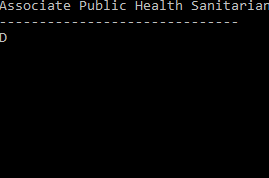

# New York City Seeks

New York City Seeks is a project that generates haikus from
New York City government job descriptions. It was created for the
[Data Through Design](http://datathroughdesign.com) art exhibit.

You can read more about the project [here](https://medium.com/@docmarionum1/new-york-seeks-haikus-generating-haikus-from-nyc-government-job-descriptions-c27496a376fd).

This repository contains the code that was used to generate the haikus
(the jupyter notebooks); the program that ran the interactive exhibit
([`main.py`](main.py)); and a [CSV](haikus.csv) of the haikus.
